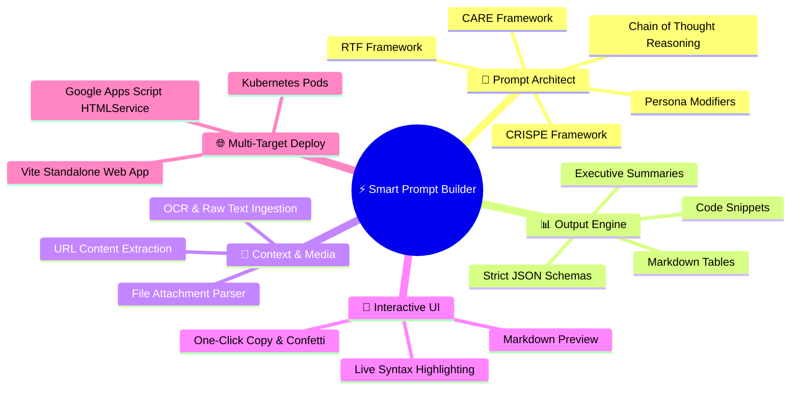
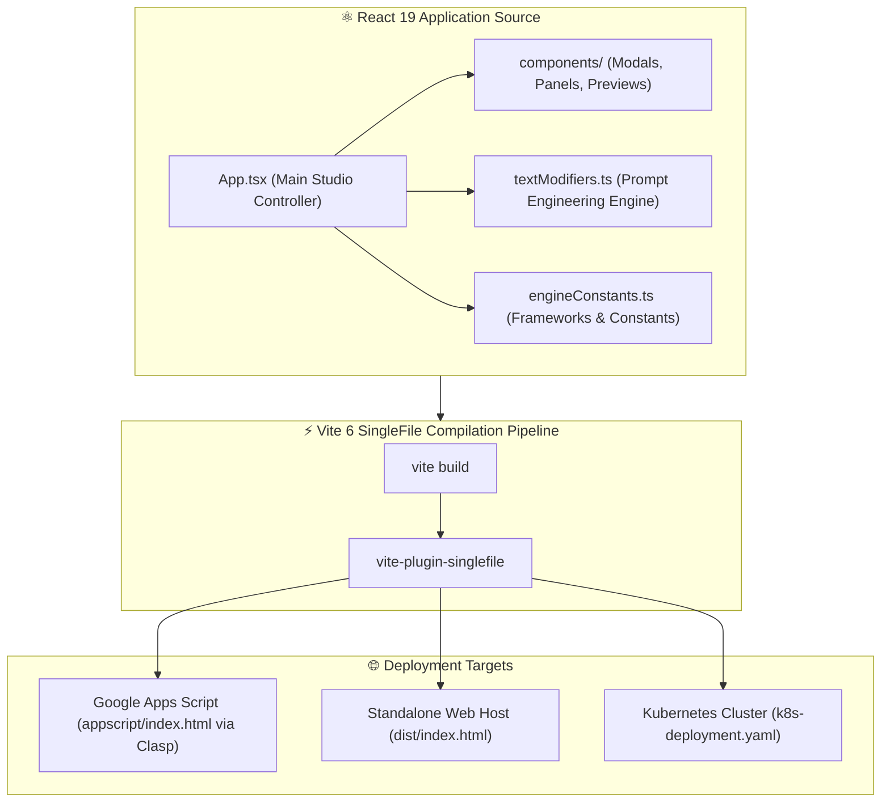

<!-- ⚡ SMART PROMPT BUILDER — REPOSITORY PRESENTATION (L3 SHOWCASE) -->

<div align="center">


# **⚡ Smart Prompt Builder**

**A next-generation visual prompt synthesis studio, multi-framework prompt compiler, and AI output structuring engine built with React 19, TypeScript, and Vite.**

[](package.json)
[](package.json)
[](tsconfig.json)
[](vite.config.ts)
[](#-deployment-options)
[](LICENSE)
[](https://img.shields.io/github/last-commit/traikdude/Smart-Prompt-Builder)

<p align="center">
  <a href="#-overview"><b>Overview</b></a> •
  <a href="#-core-features"><b>Features</b></a> •
  <a href="#-prompt-engineering-frameworks"><b>Frameworks</b></a> •
  <a href="#-universal-output-engine"><b>Output Engine</b></a> •
  <a href="#-architecture--build-pipeline"><b>Architecture</b></a> •
  <a href="#-quick-start--local-development"><b>Quick Start</b></a> •
  <a href="#-deployment-options"><b>Deployment</b></a> •
  <a href="#-contributing"><b>Contributing</b></a> •
  <a href="#-license"><b>License</b></a>
</p>

</div>

---

## 📑 Table of Contents

- [✨ Overview](#-overview)
- [🚀 Core Features](#-core-features)
  - [1. Multi-Framework Prompt Compilation](#1-multi-framework-prompt-compilation)
  - [2. Universal Output Structuring Engine](#2-universal-output-structuring-engine)
  - [3. Multi-Modal Context & Attachment Ingestion](#3-multi-modal-context--attachment-ingestion)
  - [4. Real-Time Syntax Highlighted Preview](#4-real-time-syntax-highlighted-preview)
  - [5. Single-File Hybrid Deployment](#5-single-file-hybrid-deployment)
- [🧠 Prompt Engineering Frameworks](#-prompt-engineering-frameworks)
- [📊 Universal Output Engine](#-universal-output-engine)
- [🏗️ Architecture & Build Pipeline](#-architecture--build-pipeline)
- [🛠️ Tech Stack](#-tech-stack)
- [⚡ Quick Start & Local Development](#-quick-start--local-development)
- [🌐 Deployment Options](#-deployment-options)
  - [Option A: Google Apps Script (Clasp)](#option-a-google-apps-script-clasp)
  - [Option B: Local / Web Application](#option-b-local--web-application)
  - [Option C: Kubernetes Container Deployment](#option-c-kubernetes-container-deployment)
- [🗂️ Repository Structure](#-repository-structure)
- [🤝 Contributing](#-contributing)
- [📄 License](#-license)

---

## ✨ Overview

**Smart Prompt Builder** is a specialized prompt engineering studio engineered to transform raw, ambiguous intent into deterministic, production-grade AI system prompts and instructions.

By incorporating battle-tested prompt engineering disciplines—including **CRISPE**, **CARE**, **RTF**, and **Chain-of-Thought (CoT)** reasoning—Smart Prompt Builder enables developers, architects, and researchers to rapidly assemble complex prompts with exact constraints, persona layers, structured output specifications, and multi-modal attachments.

The project compiles into an ultra-fast, self-contained single-file bundle that can run locally, in Kubernetes, or natively embedded within **Google Apps Script** as a web app.

---

## 🚀 Core Features



### 1. Multi-Framework Prompt Compilation
Select from standard prompt engineering methodologies (CRISPE, CARE, RTF) or stack custom persona, tone, and cognitive depth modifiers in real time.

### 2. Universal Output Structuring Engine
Enforce strict output boundaries on the receiving LLM. Direct the AI to format responses as JSON schemas, Markdown comparison tables, step-by-step procedures, or executive briefings.

### 3. Multi-Modal Context & Attachment Ingestion
Attach text files, documentation snippets, code files, or web URLs. The ingestion pipeline extracts and encodes content directly into the context payload.

### 4. Real-Time Syntax Highlighted Preview
Interactive dual-pane interface with instant markdown rendering (`react-markdown`), code syntax highlighting (`react-syntax-highlighter`), and celebratory copy interactions (`canvas-confetti`).

### 5. Single-File Hybrid Deployment
Leverages `vite-plugin-singlefile` to bundle React 19, CSS, and assets into an inlined `index.html` suitable for zero-dependency hosting in Google Apps Script `HtmlService`.

---

## 🧠 Prompt Engineering Frameworks

Smart Prompt Builder natively supports the leading prompt engineering structures:

| Framework | Meaning & Structure | Ideal Use Case |
|---|---|---|
| **CRISPE** | **C**apacity · **R**ole · **I**nsight · **S**tatement · **P**ersonality · **E**xperiment | Comprehensive agent definitions, complex technical briefs. |
| **CARE** | **C**ontext · **A**ction · **R**esult · **E**xample | Procedural tasks, step-by-step workflows, predictable operations. |
| **RTF** | **R**ole · **T**ask · **F**ormat | Fast, concise queries with strict presentation constraints. |
| **Chain-of-Thought (CoT)** | Explicit step-by-step reasoning instructions before final synthesis | Multi-hop logic, algorithmic verification, and mathematical analysis. |
| **Few-Shot Evals** | Input/Output exemplar pairs embedded directly into prompt | Structured data extraction and classification tasks. |

---

## 📊 Universal Output Engine

The output engine guarantees that receiving LLMs format their responses predictably:

```text
┌────────────────────────────────────────────────────────────────────────┐
│                        UNIVERSAL OUTPUT FORMATS                        │
├───────────────────────┬────────────────────────┬───────────────────────┤
│ 📋 Structured Data    │ 📑 Document Formats    │ 💻 Code & Logic       │
│ • Valid JSON Schema   │ • Executive Summary    │ • Formatted Codeblock │
│ • Markdown Matrix     │ • Step-by-Step SOP     │ • Mermaid Diagram     │
│ • CSV / TSV Export    │ • Formal Memorandum    │ • Regular Expression  │
└───────────────────────┴────────────────────────┴───────────────────────┘
```

---

## 🏗️ Architecture & Build Pipeline



---

## 🛠️ Tech Stack

* **Frontend Framework**: React 19 (`react` 19.2.3, `react-dom` 19.2.3)
* **Language & Types**: TypeScript 5.8.2 (`tsconfig.json`)
* **Build Tooling**: Vite 6.2.0 (`vite.config.ts`), `vite-plugin-singlefile`
* **Markdown & Highlighting**: `react-markdown` 9.0.1, `react-syntax-highlighter` 16.1.0
* **Animations & Micro-interactions**: `canvas-confetti` 1.6.0
* **Deployment Tooling**: `@google/clasp`, Kubernetes YAML manifests

---

## ⚡ Quick Start & Local Development

### Prerequisites
* [Node.js](https://nodejs.org/) (v18+ or v20+ recommended)
* `npm` or `pnpm`

### Setup Instructions
1. Clone the repository:
   ```bash
   git clone https://github.com/traikdude/Smart-Prompt-Builder.git
   cd Smart-Prompt-Builder
   ```
2. Install dependencies:
   ```bash
   npm install
   ```
3. Start the local Vite development server:
   ```bash
   npm run dev
   ```
4. Open `http://localhost:5173` in your browser.

---

## 🌐 Deployment Options

### Option A: Google Apps Script (Clasp)

Smart Prompt Builder can be deployed as a Google Apps Script Web App backed by Google Drive/Sheets:

```bash
# Build the single-file inlined bundle into appscript/index.html
npm run build

# Push to Google Apps Script
clasp push

# Open the Apps Script webapp in browser
clasp open
```

### Option B: Local / Web Application

```bash
# Build standard web distribution in dist/
npm run build

# Preview production build locally
npm run preview
```

### Option C: Kubernetes Container Deployment

Deploy Smart Prompt Builder into a Kubernetes cluster using the included manifests:

```powershell
# Toggle or apply the Kubernetes deployment
.\toggle-k8s.ps1
```

---

## 🗂️ Repository Structure

```text
Smart-Prompt-Builder/
├── docs/                        # Presentation & visual assets
│   └── assets/
│       └── banner.png           # L3 Showcase high-resolution hero banner
├── components/                  # Modular React UI components
├── constants/                   # Application-wide constants
├── appscript/                   # Google Apps Script manifest & compiled output
├── backend/                     # Backend helper routines & services
├── releases/                    # Historical release archives
├── App.tsx                      # Core application studio controller
├── engineConstants.ts           # Prompt framework definitions & schemas
├── textModifiers.ts             # 83KB+ core prompt compiler & modifier rules
├── types.ts                     # TypeScript interfaces & data models
├── k8s-deployment.yaml          # Kubernetes deployment specification
├── toggle-k8s.ps1               # PowerShell K8s deployment management utility
├── release.ps1                  # Release automation script
├── vite.config.ts               # Vite configuration with SingleFile plugin
├── package.json                 # Project dependencies & scripts
├── tsconfig.json                # TypeScript compiler configuration
├── README.md                    # L3 Showcase presentation documentation
└── LICENSE                      # MIT Open Source License
```

---

## 🤝 Contributing

Contributions to Smart Prompt Builder are welcome!

1. Fork the repository and create a feature branch (`git checkout -b feature/new-framework`).
2. Add new prompt engineering rules to `textModifiers.ts` or `engineConstants.ts`.
3. Verify the build runs cleanly without type errors: `npm run build`.
4. Submit a Pull Request.

---

## 📄 License

Distributed under the **MIT License**. See [LICENSE](LICENSE) for details.

---

<div align="center">

*Engineered for AI Practitioners, Prompt Engineers & Sovereign AI Agents.*  
**Smart Prompt Builder · React 19 · TypeScript · Vite · Google Apps Script**

</div>
